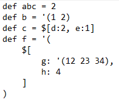

# Анализатор синтаксиса
## Задание
Разработать инструмент командной строки для учебного конфигурационного 
языка, синтаксис которого приведен далее. Этот инструмент преобразует текст из 
входного формата в выходной. Синтаксические ошибки выявляются с выдачей 
сообщений.

Входной текст на учебном конфигурационном языке принимается из 
файла, путь к которому задан ключом командной строки. Выходной текст на 
языке xml попадает в файл, путь к которому задан ключом командной строки.

Массивы:
'( значение значение значение ... )

Словари:
$[
 имя : значение,
 имя : значение,
 имя : значение,
 ...
]

Имена:
[a-zA-Z]+

Значения:
• Числа.
• Массивы.
• Словари.

Объявление константы на этапе трансляции:
def имя = значение

Вычисление константы на этапе трансляции:
?{имя}
## Реализация
Программа была реализована на языке python с использованием библиотек Lark, Transform для парсинга текста и модулей ElementTree и argparse для создания xml-дерева и парсинга аргументов командной строки
## Тесты
Тесты реализованы с помощью модулей unittest, os и subprocess. Проект содержит каталог test, в котором находятся тестовые взодные файлы и ожидаемые вызодные файлы. Программа запускает программу с командной строки с помощью модуля subprocess, а затем сравнивает полученные файлы с ожидаемыми.
### Первый тестовый текст

### Второй тестовый текст

### Ожидаемый результат первого теста

### Результат тестов
